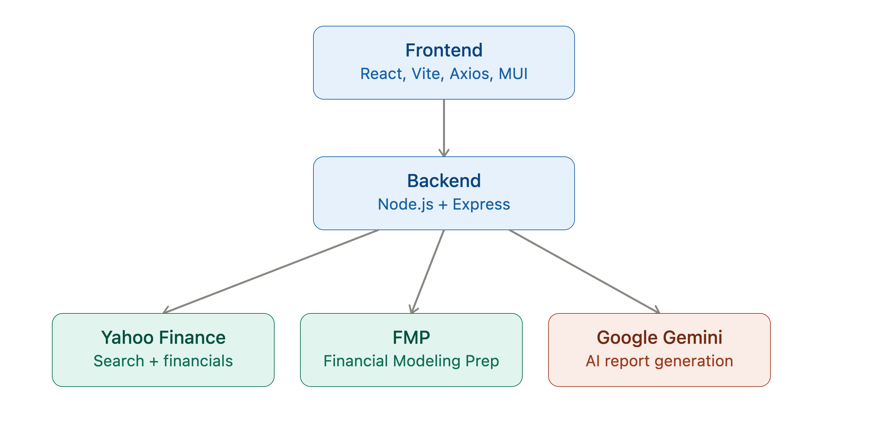
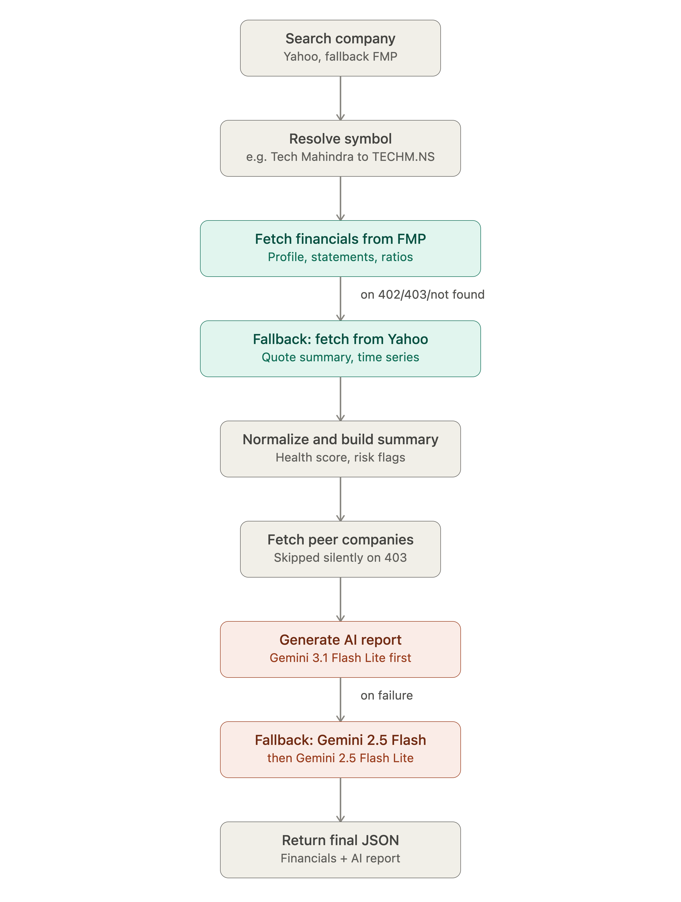

# Vestro AI — AI Investment Research Agent

An AI-powered agent that takes a company name, pulls its real financial data, scores its financial health, and generates an AI investment verdict (Invest / Pass) with reasoning — built for the InsideIIM × Altuni AI Labs assignment.

**Live demo:** Frontend — `https://vestro-rho.vercel.app` · Backend — `https://vestro-ai.onrender.com`

---

## Overview

Vestro AI searches Indian and US listed companies, resolves the correct ticker, pulls financial statements from a primary + fallback data provider, computes a deterministic financial health score, and passes that structured summary to an LLM to generate a plain-English investment report — Business Overview, Financial Performance, Growth, Risks, Competitive Position, and a final Invest/Pass verdict.

Key features:
- Company search with symbol normalization (filters out mutual funds, ETFs, invalid tickers; prioritizes NSE/BSE)
- Financial metrics: revenue, margins, ROE/ROA/ROCE, debt ratios, PE/PB/PEG, cash flow, growth rates
- Deterministic Financial Health Score + auto-generated risk flags
- AI-generated investment report via Google Gemini
- Historical revenue/earnings trends (interactive charts)
- Multi-provider fallback for reliability (financial data + LLM)

---

## How to run it

**Backend**
```bash
cd backend
npm install
```
Create `backend/.env`:
```env
PORT=
GOOGLE_API_KEY=
FMP_API_KEY=
PROXY_HOST=
PROXY_PORT=
PROXY_USERNAME=
PROXY_PASSWORD=
```
```bash
npm run dev
```

**Frontend**
```bash
cd frontend
npm install
```
Create `frontend/.env`:
```env
VITE_BACKEND_URL=
```
```bash
npm run dev
```

`GOOGLE_API_KEY` and `FMP_API_KEY` are required. The proxy variables are optional — they exist to route around Yahoo Finance's rate limiting on deployed IPs (see below).

---

## How it works

**Architecture**



The frontend (React + Vite) talks only to the Express backend. The backend owns all provider logic — search, symbol resolution, fetching statements, computing metrics, calling the LLM — and returns one normalized JSON response, so the frontend never touches Yahoo, FMP, or Gemini directly.

**Request flow**



1. User types a company name → backend searches Yahoo Finance, filtering out non-equities and preferring NSE/BSE symbols. Falls back to FMP search if Yahoo fails.
2. User selects a company → backend resolves the best ticker (e.g. "Tech Mahindra" → `TECHM.NS`).
3. Backend tries **Financial Modeling Prep** first for profile, statements, and ratios.
4. If FMP's data is incomplete (plan limits, 403s, missing statements), it falls back to **Yahoo Finance**, fetching quote summary and statements in parallel.
5. Both providers' responses are normalized into one common internal format.
6. The backend computes growth rates, margins, return ratios, the Financial Health Score, and risk flags from that normalized data.
7. The financial summary is sent to **Gemini** to generate the investment report, with a model fallback chain (Gemini 3.1 Flash Lite → 2.5 Flash → 2.5 Flash Lite) in case a model is unavailable.
8. Backend returns one JSON payload; frontend renders it into charts, tables, health score, and the AI report.

---

## Key decisions & trade-offs

- **FMP as primary, Yahoo as fallback (not the reverse).** FMP gives cleaner, pre-structured statements, which simplifies ratio calculations. Yahoo has better Indian market coverage but occasional rate limiting, so it's used as the safety net rather than the default.
- **Deterministic scoring, AI-generated explanation.** The Financial Health Score and risk flags are computed by fixed formulas in the backend, not by the LLM. Gemini only explains and contextualizes numbers that are already calculated — this keeps the verdict reproducible and the AI's role limited to reasoning/communication, not arithmetic.
- **Manual Gemini fallback chain instead of LangChain.js/LangGraph.js.** The assignment's stack calls for LangChain/LangGraph for the AI layer. I went with direct Gemini API calls plus a manual retry/fallback chain across three models, mainly because the AI step here is a single prompt-and-generate call rather than a multi-step agentic workflow, so I didn't see an immediate need for LangGraph's state graph. This is a deliberate deviation from the suggested stack — noted here rather than hidden — and it's the first thing I'd revisit with more time.
- **No database.** All data is fetched live per request; nothing is persisted. Simpler to build in the time available, at the cost of repeated API calls for repeat searches.
- **Left out:** caching, auth, portfolio/watchlist features — cut to stay inside the 7-day window and keep the core research flow solid.

---

## Example runs

| Company | Result |
|---|---|
| Apple | Company found via FMP, full statements loaded, AI report generated |
| Tech Mahindra | Resolved via Yahoo symbol matching (`TECHM.NS`), financials + AI recommendation generated |
| Infosys | Historical revenue/EPS trends, health score, growth analysis rendered |
| HDFC Bank | Financial metrics, AI investment report, risk analysis generated |

 
 
 
 
 
 
 


---

## What I'd improve with more time

- Wrap the Gemini call in LangGraph to align fully with the intended stack and support multi-step reasoning (e.g. separate nodes for risk analysis vs. recommendation)
- Redis caching for repeated company lookups
- Persist research history per user (requires auth + DB)
- Sector/peer comparison view, PDF report export
- News sentiment and SEC filing analysis as additional inputs to the AI report

---

## Author

**Ritesh Sharma** — B.Tech Computer Science, Lovely Professional University

Built for the InsideIIM × Altuni AI Labs AI Investment Research Agent assignment.